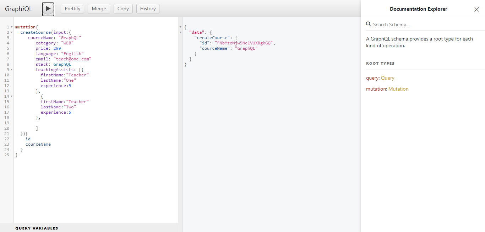
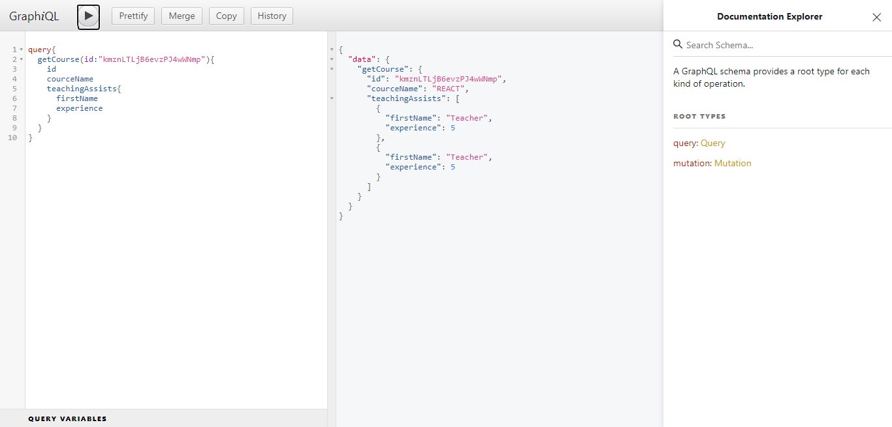

# Learning GraphQL

## Create Schema

```
import { buildSchema } from "graphql";

const schema = buildSchema(`
    <!-- defining types and fields on  type Course  -->
    type Course {
        id: ID
        courceName: String
        category: String
        price: Int
        language: String
        email: String
        stack: Stack
        teachingAssists: [TeachingAssists] //refernce to another type TeachingAssists
    }

    type TeachingAssists {
        firstName: String
        lastName : String
        experience: Int
    }

    <!-- enums -->
    enum Stack {
        REACT
        MERN
        GraphQL
        JS
        REACT NATIVE
        FLUTTER
        IOS
    }

    <!-- Query type used to query data (Read data)-->
    type Query {
        getCourse(id: ID): Course //defined method to get Course data
    }

    <!-- to add data we use input -->
    input CourseInput {
        id: ID
        courceName: String! // ! symbol used to make field required while getting input
        category: String!
        price: Int!
        language: String
        email: String
        stack: Stack
        teachingAssists: TeachingAssists
    }

    <!-- Mutation used to modify server-side data (saving data in DB) -->
    type Mutation {
        createCourse(input: CourseInput): Course
    }
`);

export default schema;

```

## Create Resolver

_Not saving data in DB (saving in local object)_

```
import { nanoid } from "nanoid";

class Course {
  constructor(
    id,
    { courceName, category, price, language, email, stack, teachingAssists }
  ) {
    this.id = id;
    this.courceName = courceName;
    this.category = category;
    this.price = price;
    this.language = language;
    this.email = email;
    this.stack = stack;
    this.teachingAssists = teachingAssists;
  }
}
<!-- local object to save data -->
const CourseHolder = {};

<!-- all method working -->
const resolvers = {
  getCourse: ({ id }) => {
    return new Course(id, CourseHolder[id]);
  },
  createCourse: ({ input }) => {
    let id = nanoid();
    CourseHolder[id] = input;
    return new Course(id, input);
  },
};


export default resolvers;
```

## GraphQL setup

```
import express from "express";
import resolvers from "./resolvers";
import schema from "./schema";
import { graphqlHTTP } from "express-graphql";

const app = express();

app.get("/", (req, res) => {
  res.send("Set up Done.");
});


const root = resolvers;
//graphiql:true flag gives web ui to work with GraphQL
app.use("/graphql", graphqlHTTP({ schema, rootValue: root, graphiql: true }));

const PORT = ANY_PORT_NUMBER;
app.listen(PORT, () => console.log(`Server Running on port ${PORT}`));

```

## To run

go to **localhost:port/graphql** in browser and GraphQL window will open.

**Mutation operation (Creating Course)**

```
mutation{
  createCourse(input:{
     courceName: "GraphQL"
        category: "WEB"
        price: 299
        language: "English"
        email: "teach@one.com"
        stack: GraphQL
    		teachingAssists: [{
          firstName:"Teacher"
          lastName:"One"
          experience:5
        },
          {
          firstName:"Teacher"
          lastName:"Two"
          experience:5
        },

        ]
  }){
    //here we are seecting values which we want to see from response
    id
    courceName
  }
}
```

**Result**


**Query operation (get data)**

```
query{
  getCourse(id:"kmznLTLjB6evzPJ4wWNmp"){
    id
    courceName
    teachingAssists{
      firstName
      experience
    }
  }
}
```

**Result**

